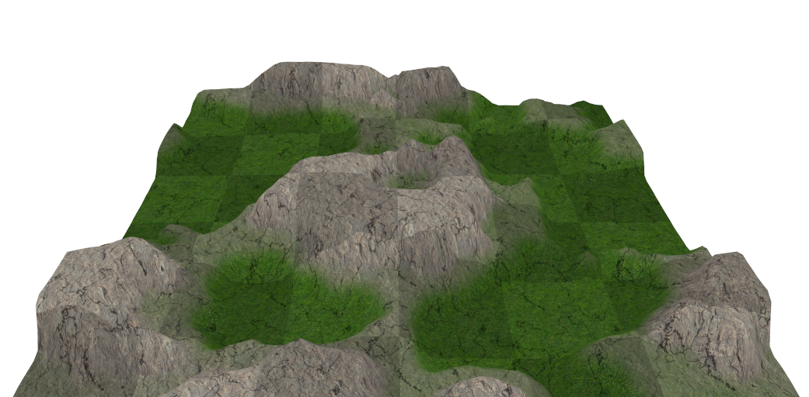
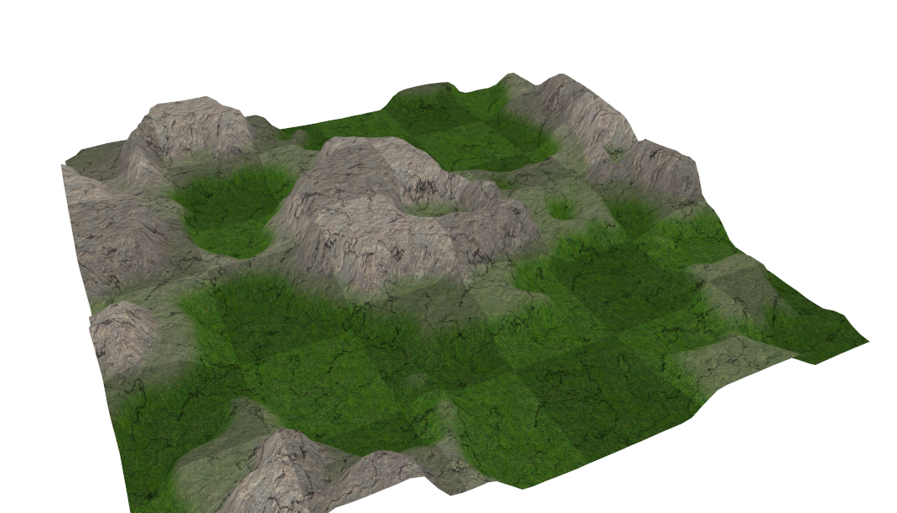
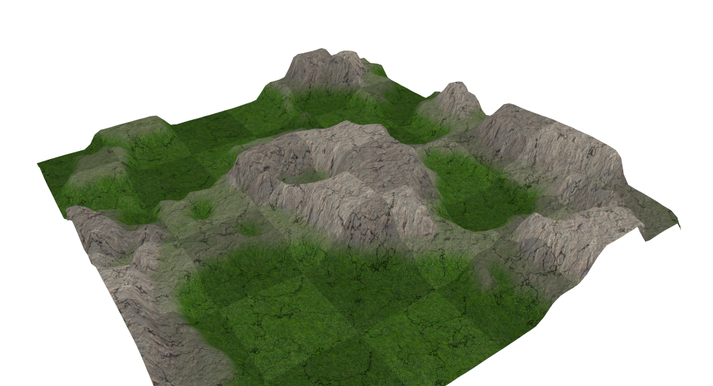
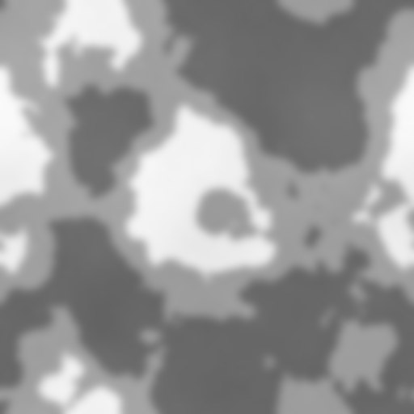
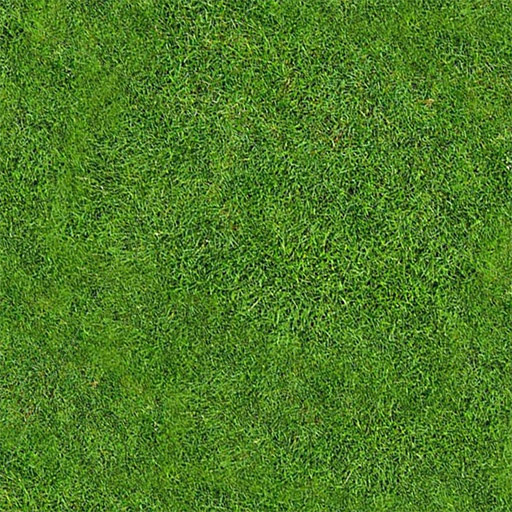
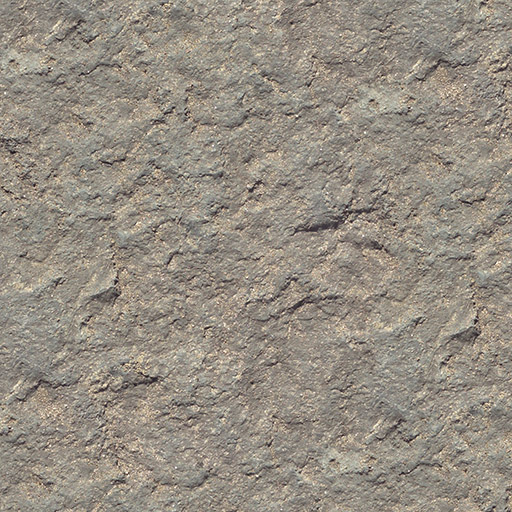
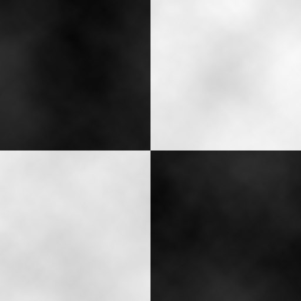
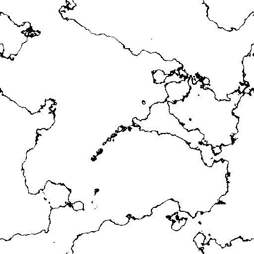

# Multitexture Terrain rendering using [ModernGL](https://github.com/cprogrammer1994/ModernGL)
Small project using [ModernGL](https://github.com/cprogrammer1994/ModernGL) for terrain rendering.

This example is using **ModernGL 4.x.x** please install with

```sh
pip install "ModernGL<5.0.0"
```

## Screenshots

[](#)
[](#)
[](#)

## VertexShader

```glsl
#version 330

uniform mat4 Mvp;
uniform sampler2D Heightmap;

in vec2 vert;

out vec2 v_text;

void main() {
	vec4 vertex = vec4(vert - 0.5, texture(Heightmap, vert).r * 0.2, 1.0);
	gl_Position = Mvp * vertex;
	v_text = vert;
}
```

## Fragment Shader

```glsl
#version 330

uniform sampler2D Heightmap;

uniform sampler2D Color1;
uniform sampler2D Color2;

uniform sampler2D Cracks;
uniform sampler2D Darken;

in vec2 v_text;

out vec4 f_color;

void main() {
	float height = texture(Heightmap, v_text).r;
	float border = smoothstep(0.5, 0.7, height);

	vec3 color1 = texture(Color1, v_text * 7.0).rgb;
	vec3 color2 = texture(Color2, v_text * 6.0).rgb;

	vec3 color = color1 * (1.0 - border) + color2 * border;

	color *= 0.8 + 0.2 * texture(Darken, v_text * 3.0).r;
	color *= 0.5 + 0.5 * texture(Cracks, v_text * 5.0).r;
	color *= 0.5 + 0.5 * height;

	f_color = vec4(color, 1.0);
}
```

## The entire code

```python
import math
import struct

import GLWindow
import ModernGL
from PIL import Image
from pyrr import Matrix44

wnd = GLWindow.create_window()
ctx = ModernGL.create_context()

prog = ctx.program([
    ctx.vertex_shader('''
        #version 330

        uniform mat4 Mvp;
        uniform sampler2D Heightmap;

        in vec2 vert;

        out vec2 v_text;

        void main() {
            vec4 vertex = vec4(vert - 0.5, texture(Heightmap, vert).r * 0.2, 1.0);
            gl_Position = Mvp * vertex;
            v_text = vert;
        }
    '''),
    ctx.fragment_shader('''
        #version 330

        uniform sampler2D Heightmap;

        uniform sampler2D Color1;
        uniform sampler2D Color2;

        uniform sampler2D Cracks;
        uniform sampler2D Darken;

        in vec2 v_text;

        out vec4 f_color;

        void main() {
            float height = texture(Heightmap, v_text).r;
            float border = smoothstep(0.5, 0.7, height);

            vec3 color1 = texture(Color1, v_text * 7.0).rgb;
            vec3 color2 = texture(Color2, v_text * 6.0).rgb;

            vec3 color = color1 * (1.0 - border) + color2 * border;

            color *= 0.8 + 0.2 * texture(Darken, v_text * 3.0).r;
            color *= 0.5 + 0.5 * texture(Cracks, v_text * 5.0).r;
            color *= 0.5 + 0.5 * height;

            f_color = vec4(color, 1.0);
        }
    '''),
])

img0 = Image.open('data/heightmap.jpg').convert('L').transpose(Image.FLIP_TOP_BOTTOM)
img1 = Image.open('data/grass.jpg').convert('RGB').transpose(Image.FLIP_TOP_BOTTOM)
img2 = Image.open('data/rock.jpg').convert('RGB').transpose(Image.FLIP_TOP_BOTTOM)
img3 = Image.open('data/cracks.jpg').convert('L').transpose(Image.FLIP_TOP_BOTTOM)
img4 = Image.open('data/checked.jpg').convert('L').transpose(Image.FLIP_TOP_BOTTOM)

tex0 = ctx.texture(img0.size, 1, img0.tobytes())
tex1 = ctx.texture(img1.size, 3, img1.tobytes())
tex2 = ctx.texture(img2.size, 3, img2.tobytes())
tex3 = ctx.texture(img3.size, 1, img3.tobytes())
tex4 = ctx.texture(img4.size, 1, img4.tobytes())

tex0.build_mipmaps()
tex1.build_mipmaps()
tex2.build_mipmaps()
tex3.build_mipmaps()
tex4.build_mipmaps()

tex0.use(0)
tex1.use(1)
tex2.use(2)
tex3.use(3)
tex4.use(4)

prog.uniforms['Heightmap'].value = 0
prog.uniforms['Color1'].value = 1
prog.uniforms['Color2'].value = 2
prog.uniforms['Cracks'].value = 3
prog.uniforms['Darken'].value = 4

index = 0
vertices = bytearray()
indices = bytearray()

for i in range(64 - 1):
    for j in range(64):
        vertices += struct.pack('2f', i / 64, j / 64)
        indices += struct.pack('i', index)
        index += 1

        vertices += struct.pack('2f', (i + 1) / 64, j / 64)
        indices += struct.pack('i', index)
        index += 1

    indices += struct.pack('i', -1)

vbo = ctx.buffer(vertices)
ibo = ctx.buffer(indices)

vao = ctx.vertex_array(prog, [(vbo, '2f', ['vert'])], ibo)

while wnd.update():
    angle = wnd.time * 0.5
    width, height = wnd.size
    proj = Matrix44.perspective_projection(45.0, width / height, 0.01, 10.0)
    look = Matrix44.look_at((math.cos(angle), math.sin(angle), 0.8), (0.0, 0.0, 0.1), (0.0, 0.0, 1.0))
    prog.uniforms['Mvp'].write((proj * look).astype('float32').tobytes())

    ctx.enable(ModernGL.DEPTH_TEST)
    ctx.viewport = wnd.viewport
    ctx.clear(1.0, 1.0, 1.0)
    vao.render(ModernGL.TRIANGLE_STRIP)
```

## Textures

### Heightmap
[](#)

### Grass
[](#)

### Rock
[](#)

### Checked
[](#)

### Cracks
[](#)

